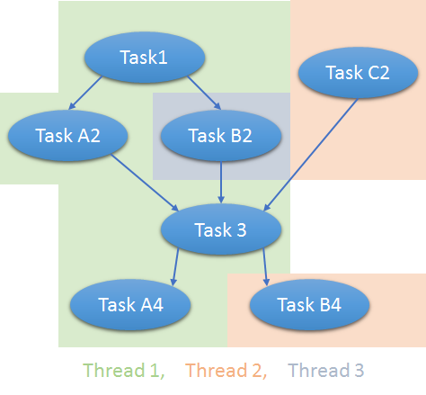

# Using FAKE's parallel option

Since multithreading is beneficial (especially for large projects) FAKE allows to specify the
number of threads used for traversing the dependency tree.
This option of course only affects independent targets whereas dependent targets will
still be exectued in order.

## Setting the number of threads
The number of threads used can be set using the environment variable ``parallel-jobs``.
This can be achieved in various ways where the easiest one is to use FAKE's built-in support for 
setting environment variables:

``FAKE.exe *YourBuildScript* "parallel-jobs=8"``

Note that the dependency tree will be traversed as usual whenever setting ``parallel-jobs`` to a value ``<= 1`` or omiting it entirely.

## Issues
* Running targets in parallel is of course only possible when the target-functions themselves are thread-safe.
* Parallel execution may also cause races on stdout and build-logs may therefore be quite obfuscated.
* Error detection may suffer since it's not possible to determine a first error when targets are running in parallel

Due to these limitations it is recommended to use the standard sequential build whenever checking for errors (CI, etc.)
However when a fast build is desired (and the project is e.g. known to build successfully) the parallel option might be helpful

## Example

When using this parallel option, Fake resolves the build dependency hierearchies from the described paths and builds independend paths as parallel if you have multiple CPUs available.
For example this dependency tree:
	
	"Task 1"
	 ==> "Task A2"
	 ==> "Task 3"

	"Task 1"
	 ==> "Task B2"
	 ==> "Task 3"

	"Task C2"
	 ==> "Task 3"

	"Task 3"
	 ==> "Task A4"

	"Task 3"
	 ==> "Task B4"
...would be treated as follows:

This is in addition to that that MsBuild may use multiple threads when building one solution having multiple independent project-files.
