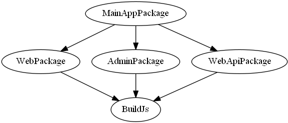

# Running targets in "FAKE - F# Make"

**Note:  This documentation is for FAKE.exe before version 5 (or the non-netcore version). The documentation needs te be updated, please help! **

## Listing targets
Before running any specific target it is useful to know all the targets that are available in a build script.
FAKE can list all the avaiable targets including the dependencies by running the following command:

* Fake.exe *YourBuildScript* -lt

The option *-lt* stands for "list targets". It is an abbreviation of the option *--listTargets*.

## Running specific targets

FAKE has a special param "target" which can be used to run specific targets in a build. We assume the following build script:

	// include Fake libs
	#I @"tools\FAKE"
	#r "FakeLib.dll"
	open Fake 

	// *** Define Targets ***
	Target "Clean" (fun () -> 
		trace " --- Cleaning stuff --- "
	)

	Target "Build" (fun () -> 
		trace " --- Building the app --- "
	)

	Target "Deploy" (fun () -> 
		trace " --- Deploying app --- "
	)

	// *** Define Dependencies ***
	"Clean"
	  ==> "Build"
	  ==> "Deploy"

	// *** Start Build ***
	RunTargetOrDefault "Deploy"

Now we have the following options:

* Fake.exe "target=Build" --> starts the *Build* target and runs the dependency *Clean*
* Fake.exe Build --> starts the *Build* target and runs the dependency *Clean*
* Fake.exe Build --single-target --> starts only the *Build* target and runs no dependencies
* Fake.exe Build -st --> starts only the *Build* target and runs no dependencies
* Fake.exe --> starts the Deploy target (and runs the dependencies *Clean* and *Build*)

## Final targets

Final targets can be used for TearDown functionality. 
These targets will be executed even if the build fails but have to be activated via ActivateFinalTarget().

	FinalTarget "CloseSomePrograms" (fun _ ->
		// close stuff and release resources
	)

	// Activate FinalTarget somewhere during build
	ActivateFinalTarget "CloseSomePrograms"


## Build failure targets

Build failure targets can be used to execute tasks after a build failure.
These targets will be executed only after a build failure but have to be activated via ActivateBuildFailureTarget().

	BuildFailureTarget "ReportErrorViaMail" (fun _ ->
		// send mail about the failure
	)

	// Activate BuildFailureTarget somewhere during build
	ActivateBuildFailureTarget "ReportErrorViaMail"

## Visualising target dependencies
FAKE can output the graph of target dependencies in the [DOT](http://www.graphviz.org/doc/info/lang.html)
format, which can then be rendered to a PNG-file by [Graphviz](http://www.graphviz.org).

Specifying the command line option *--dotGraph* (short version: *-dg*) makes FAKE write
the dependency graph to the standard output *instead* of building anything. This option only works when
the build script contains a call like this:

```
RunTargetOrDefault "Default"
``` 

### Example

Say, the build script `build.fsx` defines the target dependencies as follows:

```
// The rest of the script is omitted...

"BuildJs"
  ==> "WebPackage" <=> "AdminPackage" <=> "WebApiPackage"
  ==> "MainAppPackage"
```

The following command saves the target dependency graph in the `graph.png` file (PowerShell syntax):

```
FAKE.exe build.fsx -dg | & 'C:/Program Files (x86)/Graphviz2.38/bin/dot.exe' -Tpng -o ./graph.png
```

resulting in an image like this:


