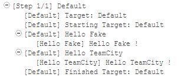

# Advanced TeamCity usage

As can be seen on the [TeamCity](teamcity.md) page FAKE is really easy to setup in TeamCity,
it also support some advanced scenarios to integrate even deeper with it.

## Displaying blocks in the log

By default each Target already is displayed as a collapsible block in the log file :


But blocks can be created in targets to separate operations more
cleanly :

```fsharp
let printHello name =
    use __ = teamCityBlock (sprintf "Hello %s" name)
    printfn "Hello %s !" name

Target "Default" (fun () ->
    printHello "Fake"
    printHello "TeamCity"
)
```


## Reporting artifacts

While TeamCity has a [great configurability](https://confluence.jetbrains.com/display/TCD10/Build+Artifact)
in terms of artifacts, nothing beats specifying them in code.

FAKE scripts also have the advantage of being versioned along the rest of your code, avoiding the need to
keep complex artifact configurations when you need to support a new branch along with old ones or the need
to configure artifacts in each build if you have multiple builds on the same repository.

```fsharp
Target "NuGet" (fun () ->
    Paket.Pack (fun p -> { p with OutputPath = "." })

    !! "*.nupkg"
    |> Seq.iter(PublishArtifact)
)
```

## Customizing version numbers

Each build is assigned a build number in TeamCity that is available as `TeamCityBuildNumber` from FAKE
and that is shown in the TeamCity dashboard :


But TeamCity also support that builds customize their version number by reporting it directly, using this
feature from FAKE is simple and when coupled with other parameters reported by TeamCity can allow complex
versioning schemes.

This code read versions from a release notes file and if TeamCity is detected label versions as pre-release
when they come from a branch that isn't the default one or from a personal build :

```fsharp
// Placed outside any Target
let releaseNotes =
    let fromFile = ReleaseNotesHelper.LoadReleaseNotes ("Release Notes.md")
    if buildServer = TeamCity then
        let buildNumber = int (defaultArg TeamCityBuildNumber "0")
        let asmVer = System.Version.Parse(fromFile.AssemblyVersion)
        let asmVer = System.Version(asmVer.Major, asmVer.Minor, buildNumber)
        let prerelease =
            if TeamCityBuildIsPersonal then "-personal"
            else if getTeamCityBranchIsDefault () then "" else "-branch"
        let nugetVersion = asmVer.ToString() + prerelease

        ReleaseNotesHelper.ReleaseNotes.New(asmVer.ToString(), nugetVersion, fromFile.Date, fromFile.Notes)
    else
        fromFile

SetBuildNumber releaseNotes.NugetVersion
```


## Reporting test results

In addition to artifacts, TeamCity also allow to report test results that will be
visible in the dashboard directly from the build.

Each test runner has a specific function to send it's result that can be found in the
[TeamCityHelper API](apidocs/fake-teamcityhelper.html) like here for NUnit :

```fsharp
Target "Tests" (fun () ->
    testDlls
    |> NUnit(fun p ->
        { p with
            OutputFile = outputFile
            // If the build fails immediately the
            // test results will never be reported
            ErrorLevel = DontFailBuild
        })

    sendTeamCityNUnitImport outputFile
)
```

*Note:* NUnit version 3 is a special case as it directly support TeamCity and it's
enough to set `TeamCity = (BuildServer = TeamCity)` in
[it's configuration](apidocs/fake-testing-nunit3-nunit3params.html).
